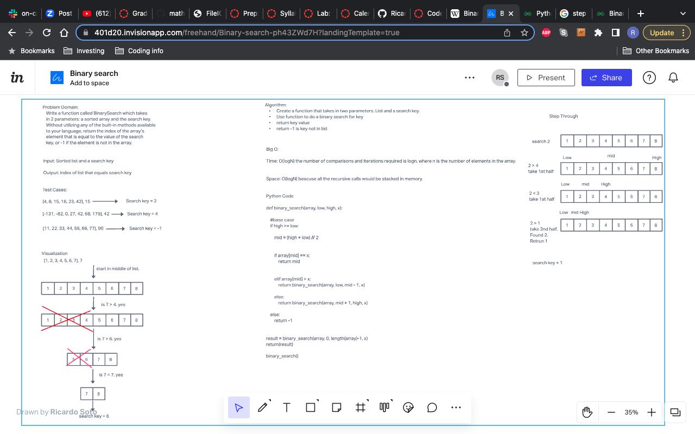

# Binary search in a sorted 1D array
Create a whiteboard to create a method that use binary serach.

## Whiteboard Process
<!-- Embedded whiteboard image -->

## Approach & Efficiency
<!-- What approach did you take? Discuss Why. What is the Big O space/time for this approach? -->
I took the recursion way because to me it seemed easier to do. Both Big O for time and space are O(logN). For space its because the
Recursion takes up memory. Time because the number of comparisons and iterations required is logn.
