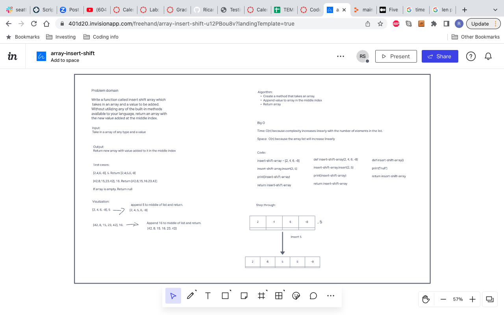

# Insert to Middle of an Array
Create a whiteboard to create a method that takes a list and append a value to the middle of list.

## Whiteboard Process
<!-- Embedded whiteboard image -->

## Approach & Efficiency
<!-- What approach did you take? Discuss Why. What is the Big O space/time for this approach? -->

The approach I took was to use the insert method to append the value into the middle of the list.
Big O for time and space were both O(n) because they both increase linearly.
