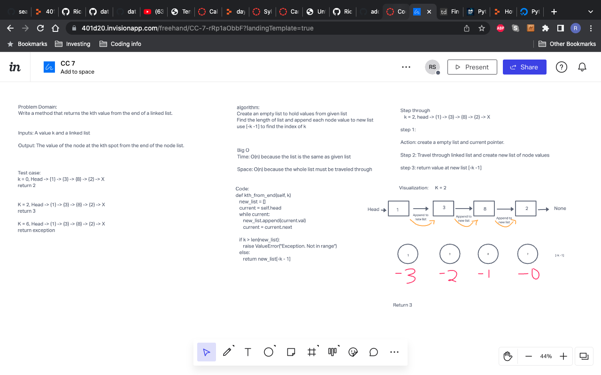

Documentation: Your README.md
# k-th value
<!-- Short summary or background information -->
- Find the k value of an list starting from the end

## Challenge
<!-- Description of the challenge -->
- kth from end
- argument: a number, k, as a parameter.
- Return the node’s value that is k places from the tail of the linked list.

## Approach & Efficiency
<!-- What approach did you take? Why? What is the Big O space/time for this approach? -->
- The approach I did was to figure out how long the node list we are searching for. Than take that number and use [-k - 1] to figure out the answer to k.

## API
<!-- Description of each method publicly available to your Linked List -->
- kth_from_end will travel through link list and append node values to new list to figure out how long the list is.
- it will go the end of new list and use the formula [- k - 1] to figure out the index of k.

## Whiteboard

