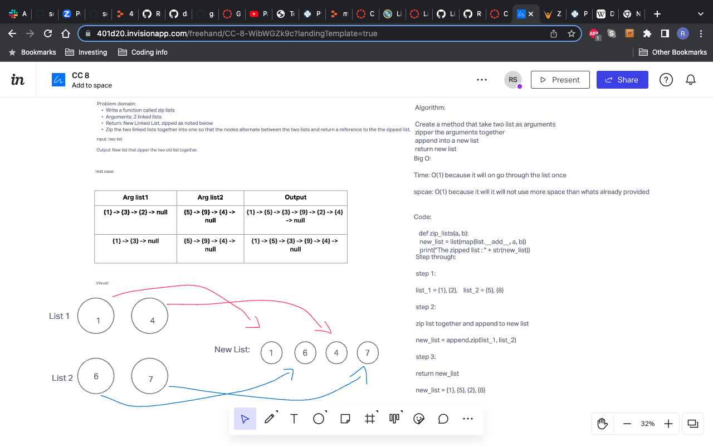

Documentation: Your README.md
# linked list zip
<!-- Short summary or background information -->
- Zip the two linked lists together into one so that the nodes alternate between the two lists and return a reference to the the zipped list.
## Challenge
<!-- Description of the challenge -->
- Write a function called zip lists
- Arguments: 2 linked lists
- Return: New Linked List, zipped.

## Approach & Efficiency
<!-- What approach did you take? Why? What is the Big O space/time for this approach? -->
- just put something in to try but than went to do lab since I was finishing up yesterday code challenge.
## API
<!-- Description of each method publicly available to your Linked List -->

## Whiteboard

