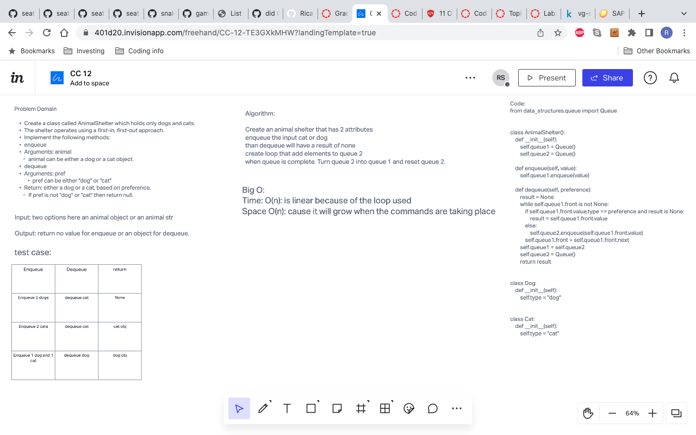

# First-in, First out Animal Shelter.

# Challenge Summary
<!-- Description of the challenge -->
- Create a animal shelter class that uses enqueue and dequeue methods to pick a dog or cat from the shelter.

## Whiteboard Process
<!-- Embedded whiteboard image -->

## Approach & Efficiency
<!-- What approach did you take? Why? What is the Big O space/time for this approach? -->
The approach I took was to figure out how create a method to enqueue or dequeue cats and dogs from the shelter if a way that would pass all test too.

## Solution
<!-- Show how to run your code, and examples of it in action -->
How to run the code to see if the test pass is pytest -k test_stack_queue_animal_shelter.py
