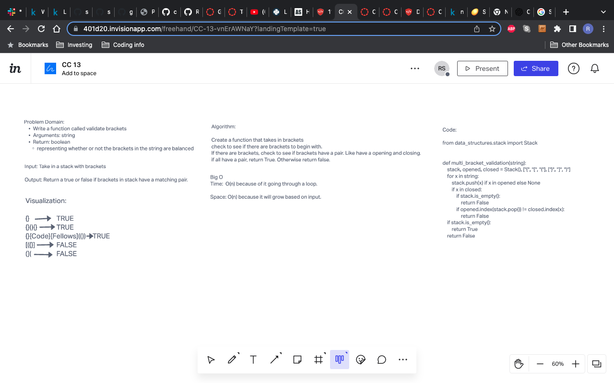

# stack-queue-brackets

# Challenge Summary
<!-- Description of the challenge -->
- Write a function called validate brackets and check to see whether or not there are brackets are inside of it.
- If there are, are the brackets balanced?

## Whiteboard Process
<!-- Embedded whiteboard image -->

## Approach & Efficiency
<!-- What approach did you take? Why? What is the Big O space/time for this approach? -->
- First I wanted to create a function to see if its stack is empty or not.
- Then if the stack is not empty. figure out a way to check if the brackets inside have a matching pair of opening and closing to it.
- Check to see if function can pass the test required.

## Solution
<!-- Show how to run your code -->
-  pytest -k test_stack_queue_brackets.py
