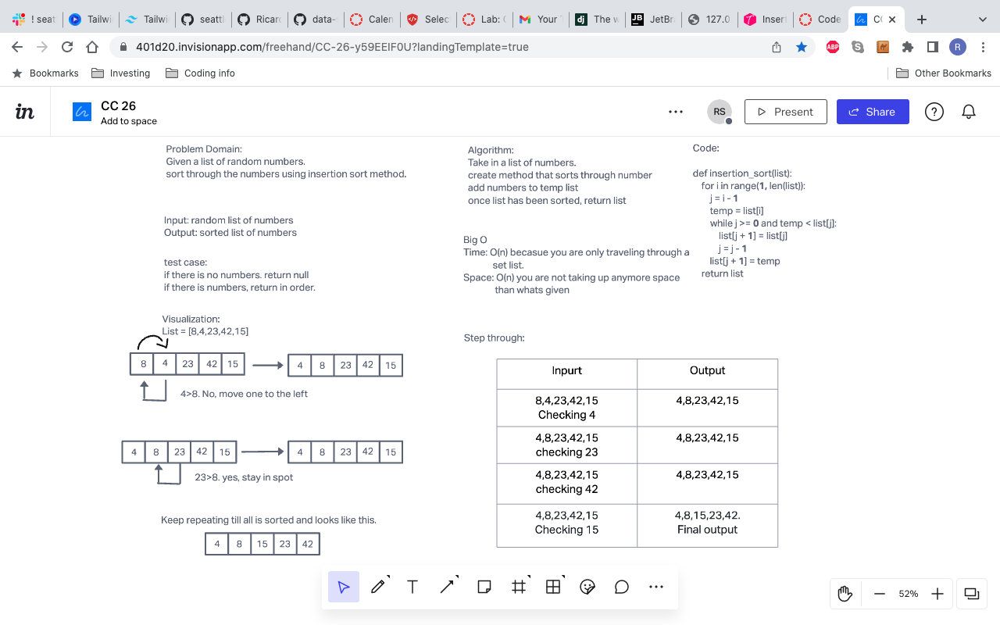

# insertion sort

# Challenge Summary
<!-- Description of the challenge -->
- insertion sort will look through a given list and sort it out. It works by starting at the first number.
- Once it figured out that first number it will move to the second one and determinded if its greater than the number to the left of it.
- If it is, it will stay in place. If not, than it will move to the left one spot till it is greater than the number to the left.

## Whiteboard Process
<!-- Embedded whiteboard image -->

## Approach & Efficiency
<!-- What approach did you take? Why? What is the Big O space/time for this approach? -->
- Big O for both time and space is O(n).

## Solution
<!-- Show how to run your code -->
-  pytest -k test_insertion_sort.py
